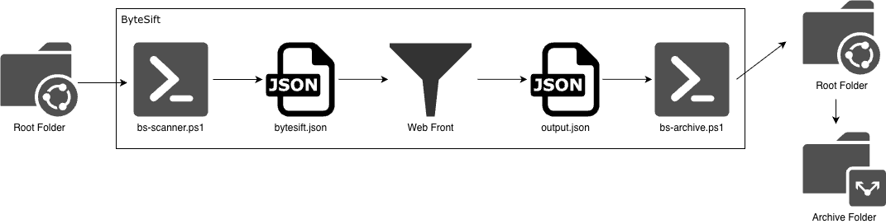
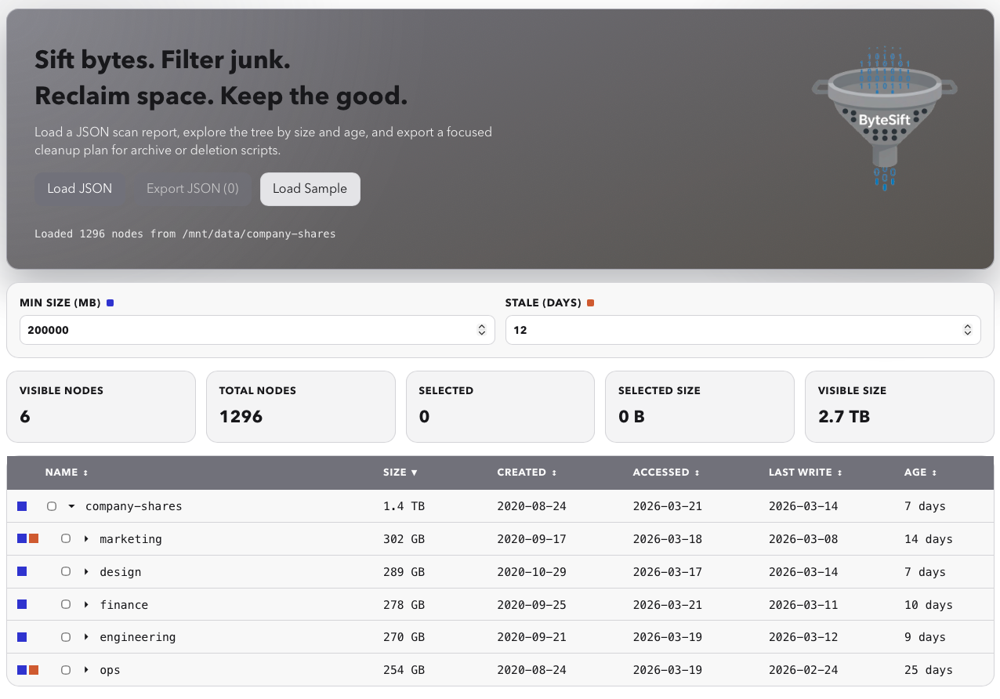

# ByteSift

ByteSift is an open-source toolkit for finding large and stale files before they become storage debt.

It includes:
- A React + Vite + TypeScript web app for interactive tree analysis
- PowerShell scanner script that generates input JSON
- PowerShell archive/delete script that processes output JSON
- Azure static web app deployment script (Storage Static Website)

## Features

- Interactive file tree
- Sort by name, size, created date, accessed date, or last-write date
- Configurable thresholds for stale age and minimum size
- Highlight stale and large files/directories

## Workflow

[)](README-images/workflow.png)

- Target a folder with the `bs-scanner.ps1` script
- Import JSON file to web front
- Mark stale and large files
- Export JSON
- Target exported JSON with `bs-archive.ps1`
- Delete or archive files and folders


## Project Structure

- `.github/workflows/ci.yml`: CI pipeline
- `.github/workflows/deploy-azure.yml`: Azure pipeline
- `src/`: ByteSift web app (React/Vite)
- `public/sample-input.json`: realistic sample scan data (100+ nodes)
- `scripts/bs-scanner.ps1`: PowerShell scanner
- `scripts/bs-archive.ps1`: PowerShell archive/delete executor
- `scripts/bs-deploy-webapp.ps1`: Azure deployment helper

## Local Web App

Requirements:
- Node.js 20+ (Node.js 22 recommended)
- npm

Install and run:

```bash
npm install
npm run dev
```

## Scanner Scripts

### PowerShell scanner

```powershell
pwsh ./scripts/bs-scanner.ps1 -Root "/path/to/root"
```

Exclude folders by name or wildcard path pattern:

```powershell
pwsh ./scripts/bs-scanner.ps1 -Root "/path/to/root" -ExcludeFolder "node_modules",".git","dist/*"
```

## Archive/Delete Scripts

Use json exported by the web app.

### Archive files

```powershell
pwsh ./scripts/bs-archive.ps1 -Input "output.json" -Archive -ArchiveRoot "./bytesift-archive"
```

### Delete files, create a report and show verbose messages

```powershell
pwsh ./scripts/bs-archive.ps1 -Input "output.json" -Delete -Report "./bytesift-report.json" -Verbose
```

### Dry-run preview is available in archive script:

```powershell
pwsh ./scripts/bs-archive.ps1 -Input "output.json" -Archive -DryRun
```

## Deploy Web App To Azure

Requirements:
- Azure CLI installed and logged in (`az login`)
- PowerShell 7+

Deploy to Azure Storage static website:

```powershell
pwsh ./scripts/bs-deploy-webapp.ps1 -ResourceGroup "rg-bytesift" -Location "swedencentral" -StorageAccount "stbytesift"
```

## Screenshot

[)](README-images/screenshot.png)
